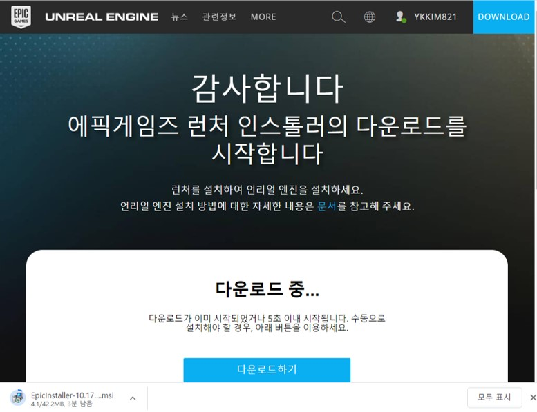
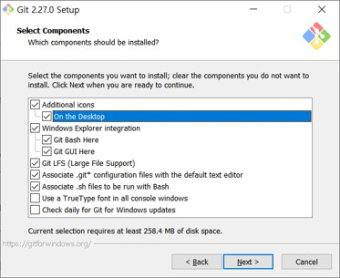
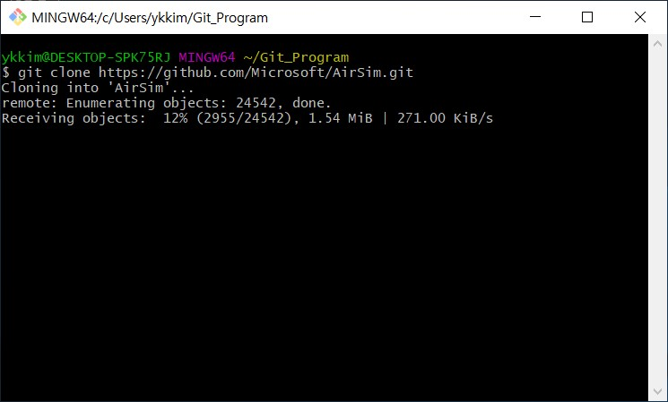
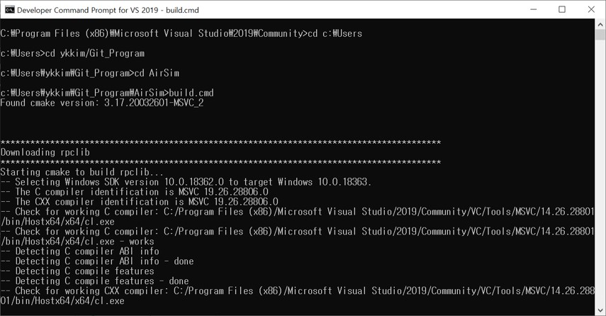
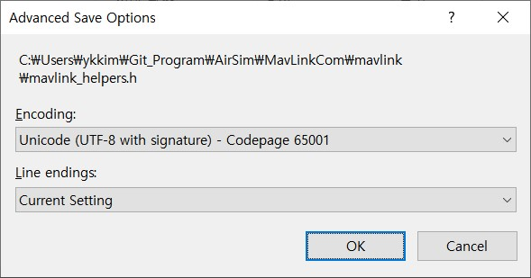

# Install and Build AirSim

## On Windows

### Install Unreal Engine

1. [Download](https://www.unrealengine.com/download) the Epic Games Launcher. While the Unreal Engine is open source and free to download, registration is still required.

    

2. Run the Epic Games Launcher, open the `Library` tab on the left pane. Click on the `Add Versions` which should show the option to download **Unreal 4.24** as shown below. If you have multiple versions of Unreal installed then **make sure 4.24 is set to `current`** by clicking down arrow next to the Launch button for the version.

   **Note**: AirSim also works with UE &gt;= 4.22, however, we recommend you update to 4.24. 

   

### Install Git for Windows

* [Download](https://git-scm.com/) Git for Windows (lastes source, release 2.27.0)
* Use default settings to install
  
  
### Install Visual Studio

* Install Visual Studio 2019.

  > **Note**: Use **English** for the VS2019 language. If you choose **Korean**, you may need to convert 'UTF Encoding' is some AirSim source files.

   
  
* **Make sure** to select **Desktop Development with C++** and **Windows 10 SDK 10.0.18362** (should be selected by default) while installing VS 2019.

   

### Download AirSim

* Start `Git Bash` or `Git GUI`
* Move to the target directory to install AirSim. Use `cd` command to change directory
* Clone the AirSim repo by typing
  
  ```text
     git clone https://github.com/Microsoft/AirSim.git
  ```

  

### Build AirSim

* Open `Command Prompt for VS2019`
* Move to the installed AirSim directory by `cd AirSim`.
* Run `build.cmd` from the command line. This will create ready to use plugin bits in the `Unreal\Plugins` folder that can be dropped into any Unreal project.
  

  > **Build error**:  If the build error message is related to UTF decoding Go to FAQ #1

### Build Unreal Project

Finally, you will need an Unreal project that hosts the environment for your vehicles. AirSim comes with a built-in "Blocks Environment" which you can use, or you can create your own. 

Please see [setting up Built-in Block  Environment](../tutorial/tutorial_block.md).

Also, see [setting up Unreal Environment](https://microsoft.github.io/AirSim/unreal_proj/) for more detail.

## FAQ

#### Building Error message of Error C2220

The initial setting for VS2019 gives the warning as the compile error.
This error has to do with some sources have some characters encoded which shows warning by the compiler.

* Open the header/source files that gives encoding warning with VS2019
* **Save As** with **Save with Encoding**: Encoding **UTF-8 with signature**

  

  

#### Clashes of VS 2017 and VS2019. How to force Unreal to use Visual Studio 2019

If different versions of Visual Studio are installed. such as VS2017 and VS 2019,  Unreal may be associated with VS2017. Building an AirSim project in VS2019 with Unreal associated with VS2017 can give build error.

Need to Change the Unreal configuration to associate with VS2019

* Open `C:\Users$user\AppData\Roaming\Unreal Engine\UnrealBuildTool\BuildConfiguration.xml`
* Modify as following
  
  ```xml
  <?xml version="1.0" encoding="utf-8" ?>
  <Configuration xmlns="https://www.unrealengine.com/BuildConfiguration">
  <BuildConfiguration>
      </BuildConfiguration>
      <VCProjectFileGenerator>
          <Version>VisualStudio2019</Version>
      </VCProjectFileGenerator>

      <WindowsPlatform>
          <Compiler>VisualStudio2019</Compiler>
      </WindowsPlatform>
  </Configuration>
  ```
