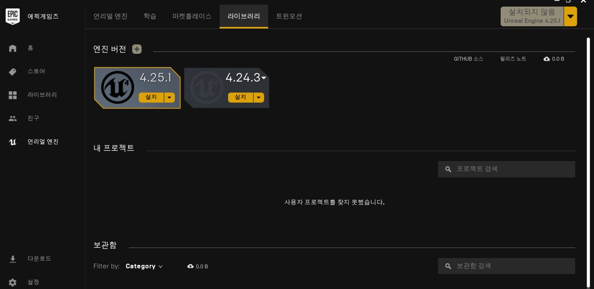
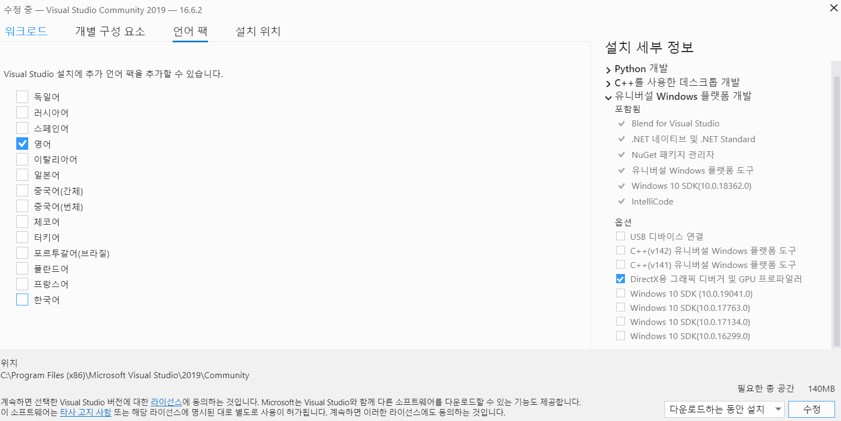
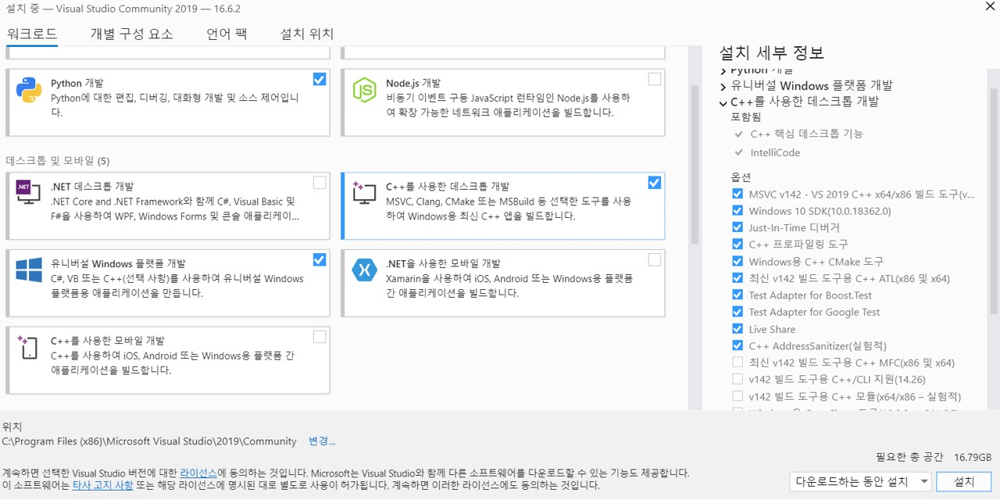

# Build on Windows

### Install Unreal Engine

1. [Download](https://www.unrealengine.com/download) the Epic Games Launcher. While the Unreal Engine is open source and free to download, registration is still required.
    
2. Run the Epic Games Launcher, open the `Library` tab on the left pane. Click on the `Add Versions` which should show the option to download **Unreal 4.24** as shown below. If you have multiple versions of Unreal installed then **make sure 4.24 is set to `current`** by clicking down arrow next to the Launch button for the version.

   **Note**: AirSim also works with UE &gt;= 4.22, however, we recommend you update to 4.24. **Note**: If you have UE 4.16 or older projects, please see the [upgrade guide](https://github.com/ykkimhgu/gitbook_docs/tree/744cefa60529ba375f5fbccce60616d217c2429b/airsim/setup/unreal_upgrade.md) to upgrade your projects.

   

### Install Visual Studio

* Install Visual Studio 2019.


   **Note**: Use **English** for the VS2019 language. If you choose **Korean**, you may need to convert 'UTF Encoding' is some AirSim source files.

   
  
  **Make sure** to select **Desktop Development with C++** and **Windows 10 SDK 10.0.18362** \(should be selected by default\) while installing VS 2019.

   
    

### Build AirSim
* Start `Developer Command Prompt for VS 2019`.
* Clone the repo: `git clone https://github.com/Microsoft/AirSim.git`, and go the AirSim directory by `cd AirSim`.
* Run `build.cmd` from the command line. This will create ready to use plugin bits in the `Unreal\Plugins` folder that can be dropped into any Unreal project.

### Build Unreal Project

Finally, you will need an Unreal project that hosts the environment for your vehicles. AirSim comes with a built-in "Blocks Environment" which you can use, or you can create your own. Please see [setting up Unreal Environment](https://github.com/ykkimhgu/gitbook_docs/tree/744cefa60529ba375f5fbccce60616d217c2429b/airsim/setup/unreal_proj.md).

## FAQ

#### How to force Unreal to use Visual Studio 2019?

If the default `update_from_git.bat` file results in VS 2017 project, then you may need to run the `C:\Program Files\Epic Games\UE_4.24\Engine\Binaries\DotNET\UnrealBuildTool.exe` tool manually, with the command line options `-projectfiles -project=<your.uproject> -game -rocket -progress -2019`.

If you are upgrading from 4.18 to 4.24 you may also need to add `BuildSettingsVersion.V2` to your `*.Target.cs` and `*Editor.Target.cs` build files, like this:

```text
    public AirSimNHTestTarget(TargetInfo Target) : base(Target)
    {
        Type = TargetType.Game;
        DefaultBuildSettings = BuildSettingsVersion.V2;
        ExtraModuleNames.AddRange(new string[] { "AirSimNHTest" });
    }
```

You may also need to edit this file:

```text
"%APPDATA%\Unreal Engine\UnrealBuildTool\BuildConfiguration.xml
```

