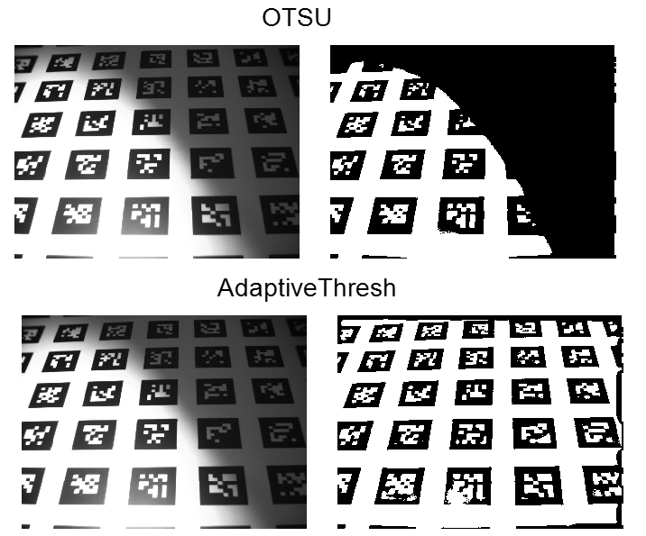
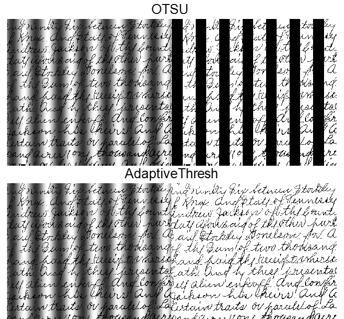

# Thresholding

$$
a = b *b
$$

$${\label{eq.1}} F=\alpha A+\beta W=\beta(\frac{\alpha}{\beta}A+W)$$

\begin{equation}{\label{eq.1}} F=\alpha A+\beta W=\beta\(\frac{\alpha}{\beta}A+W\) \end{equation},

**A Short Summary of Thresholding Algorithm**

* The basic concept of thresholding: to segment objects from the background based on intensity values.
* A simple method is making the output result as a binary image as

* Multiple thresholding

1. Analyze the intensity histogram and select the initial estimation of \(usually the mean of the image intensity\). Let the intensity of the input image is defined as g\(x,y\).
2. Segment the image by two groups on the histogram using the value of 

1. Find the mean of and \(i.e. _m1_ and _m2_\)
2. The new value at kth iteration

1. repeat from step 2 until , where 
2. OTSU’s method.
3. The aim is to maximize the between-class variance based on the histogram of an image
4. First, calculate the normalized histogram , with _ni_ is the number of pixels with the intensity level _I_, and it should satisfy

* Let us define the mean intensity of the entire image as

which is equivalent to

Probability of, given that comes from the class 

 \(using Bayes’ formula\)

Note: Bayes formula

* \* 
* Then, the mean of intensity of class  becomes

* Similarly, the mean of intensity of class  becomes

where  and 

* The cumulative mean intensity from ‘0’ up to level is defined as

 // 

* Thus, we can express the total mean intensity as

since the total mean intensity is 

* To evaluate the ‘goodness’ of the threshold values of , we can design a score

is the global variance

is the between-class variance

The further the two means of and are from each other, the larger  will be

larger value of _η._

To make the calculation simpler, we transform the formula as

The Procedure of Otsu Method

Aim: obtain the maximum  from the calculation of for all values of _k_

1. Apply an image filter prior to thresholding.
2. Compute the normalized histogram 
3. Compute the cumulative sum , to
4. Compute the cumulative mean , to
5. Compute the global intensity mean 
6. Compute , for all 
7. Find k\* at which  is at maximum
8. Apply threshold at \*
9. Local thresholding

Method 1. Image partitioning

* Subdivide an image into non overlapping rectangles. Apply otsu threshold in each sub division.
* Works well when the objects and background occupy reasonably comparable size.
* But fails if either object or background is small.

Method 2. Based on local image property

preferable if background is nearly uniform.

Method 3. Moving average.

* Scan line by line in zigzag to reduce illumination effect

Where is intensity of the point at step in the number of points area in M.A 

Use 

See example with text image corrupted by spot shading

